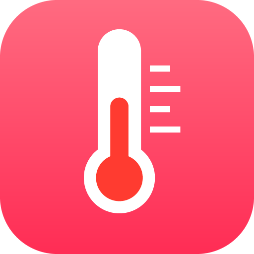
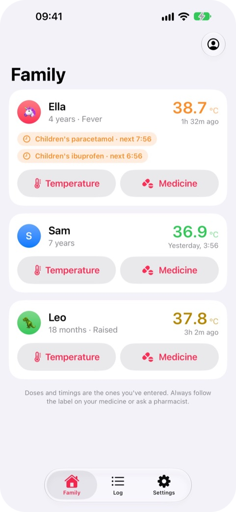
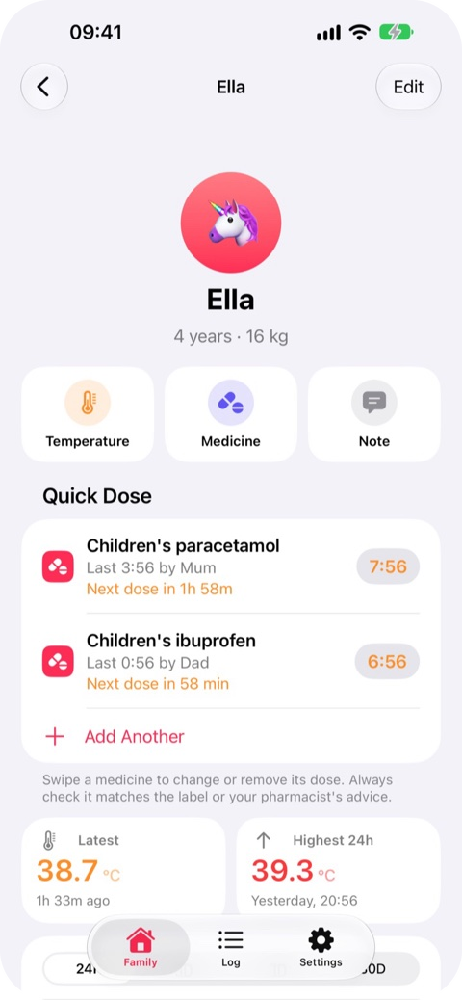
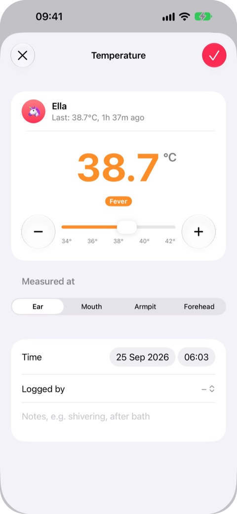
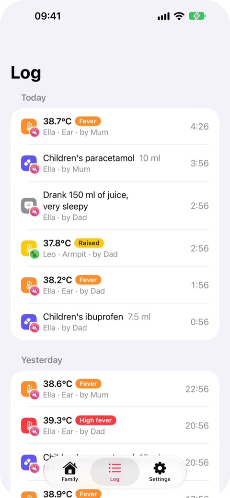

<p align="center">
  
</p>

<h1 align="center">NestHealth server</h1>

<p align="center">
  <strong>A private, self-hosted fever and medicine log for families.</strong><br>
  Every parent's phone shares the same temperatures and doses, and nothing ever leaves your home.
</p>

<p align="center">
  <a href="https://hub.docker.com/r/hansford909/nesthealth-server"></a>
  <a href="https://hub.docker.com/r/hansford909/nesthealth-server"></a>
  <a href="https://hub.docker.com/r/hansford909/nesthealth-server/tags"></a>
  
  <br>
  <a href="https://github.com/mahansford/nesthealth-server/actions/workflows/docker.yml"></a>
  <a href="LICENSE"></a>
  
  
  
</p>

<p align="center">
  <a href="https://nesthealth.soam.uk">Website</a> ·
  <a href="https://nesthealth.soam.uk/docs">Documentation</a> ·
  <a href="https://hub.docker.com/r/hansford909/nesthealth-server">Docker Hub</a> ·
  <a href="https://nesthealth.soam.uk/support">Support</a>
</p>

---

When someone in the family is poorly, it's hard to remember who had what and when, especially at 3am and when two parents are taking turns. **NestHealth** keeps every temperature and every dose in one place, and shows at a glance when the next dose can be given.

This repository is the **NestHealth server**: a small, dependency-free Node.js program that stores your family's records in SQLite and serves both the API for the NestHealth iPhone app and a full **web app** that works in any browser.

<p align="center">
  
  &nbsp;
  
  &nbsp;
  
  &nbsp;
  
</p>
<p align="center"><sub>The NestHealth iPhone app, connected to a NestHealth server.</sub></p>

## Contents

- [Features](#features)
- [Quick start](#quick-start)
- [Connecting the iPhone app](#connecting-the-iphone-app)
- [The web app](#the-web-app)
- [HTTPS and access away from home](#https-and-access-away-from-home)
- [Notifications](#notifications)
- [Configuration](#configuration)
- [Backups and updating](#backups-and-updating)
- [Security and privacy](#security-and-privacy)
- [Running without Docker](#running-without-docker)
- [How it's built](#how-its-built)
- [Licence](#licence)

## Features

**Logging**
- Temperatures in seconds, with − / + buttons, a slider or the keyboard: ear, mouth, armpit or forehead, in °C or °F.
- Medicines, doses and free-text notes (fluids, sleep, symptoms), each recorded with who logged it.
- Colour-coded readings, from normal through raised and fever to high fever.

**Knowing when the next dose is allowed**
- Each medicine has a minimum time between doses and a daily maximum, set by you from its label.
- **Quick Dose:** save each child's usual dose from their medicine's label, then log it with one tap.
- A warning if it's too soon for another dose, and a reminder when it can be given again.
- NestHealth **never calculates doses**. It only records what you enter.

**Seeing the picture**
- A family screen with everyone's latest reading and "next dose" countdowns.
- Temperature charts over 24 hours to 30 days, with doses marked.
- A day-by-day history for each person, a log for the whole family, and CSV export.

**Sharing with the family**
- An account for each parent or carer, managed by the admin, with temporary passwords for new accounts.
- Passkeys (Face ID, Touch ID or your screen lock) in the web app over HTTPS.
- Notifications through Web Push and webhooks: ntfy, Home Assistant, Node-RED, n8n, Discord or Slack.
- Profile photos, a settings passcode to keep little fingers out, and light and dark mode.

## Quick start

You need an always-on computer with Docker: a home server, a NAS or a Raspberry Pi. The image is on Docker Hub for amd64 and arm64.

```bash
mkdir nesthealth && cd nesthealth
curl -O https://nesthealth.soam.uk/download/docker-compose.yml
docker compose up -d
```

Or, without a compose file:

```bash
docker run -d --name nesthealth --restart unless-stopped -p 8080:8080 \
  -e TZ=Europe/London -v nesthealth-data:/data hansford909/nesthealth-server
```

Then open `http://<server-address>:8080` (for example `http://192.168.1.20:8080`) and create the first account. That account is the **admin**, who adds the rest of the family under **Settings → Family Accounts**.

It also runs in NAS apps such as Synology Container Manager, Unraid and Portainer: use the image `hansford909/nesthealth-server`, port `8080`, and a volume or folder mounted at `/data`.

<details>
<summary><strong>Building the image from source</strong></summary>

```bash
git clone https://github.com/mahansford/nesthealth-server.git
cd nesthealth-server
```

In `docker-compose.yml`, replace the `image:` line with `build: .`, then:

```bash
docker compose up -d --build
```
</details>

## Connecting the iPhone app

1. In NestHealth on iPhone, choose **Share with the family**. If you've been using *Just this iPhone*, go to **Settings → Data → Connect to a Home Server** instead, and your records can be copied across.
2. Enter the server's address including the port, such as `http://192.168.1.20:8080`, or its HTTPS address.
3. Sign in with your account.

The app works fully on its own too ("Just this iPhone"), with no server or account. The server is what lets several phones share the same records.

| On your own server | |
|---|---|
| Shared records and sign-in | ✅ |
| Reminders when a dose can be given again (scheduled on each iPhone) | ✅ |
| Home Screen and Lock Screen widgets, and the Lock Screen countdown | ✅ |
| Instant alerts in the iPhone app when *another* parent logs a dose or fever | ❌ Use Web Push or a webhook such as ntfy |
| Passkeys in the iPhone app | ❌ Sign in with your password; passkeys work in the web app |

Instant alerts and passkeys inside the iPhone app rely on Apple keys that belong to the app, so they only work with the developer's own server.

## The web app

Open the server's address in any browser to use NestHealth on a computer, an Android phone or a tablet. It has the same features as the iPhone app.

- **iPhone and iPad:** open it in Safari, then **Share → Add to Home Screen**. It opens full screen, like an app.
- **Android:** open it in Chrome, then **⋮ → Add to Home screen** (or **Install app**).

## HTTPS and access away from home

On your home network, plain `http://` works for logging and syncing. **HTTPS** is needed for Web Push and passkeys, and a VPN or tunnel lets you use NestHealth away from home:

- **Tailscale** (easiest): `tailscale serve --bg 8080` gives you `https://<machine>.<tailnet>.ts.net` on every device in your tailnet.
- **A reverse proxy** such as Caddy, Nginx Proxy Manager or Traefik, with a certificate for a domain you own.
- **Cloudflare Tunnel.** This makes the server reachable from the internet, so put Cloudflare Access in front of it.

Behind a proxy, set `PUBLIC_URL` to the HTTPS address people use so passkeys work.

## Notifications

Set these up in the web app under **Settings → Notifications**, and choose which events to be told about.

| Event | Sent when |
|---|---|
| `dose_due` | A medicine can be given again |
| `dose_given` | Another parent logs a dose (you're not notified about your own) |
| `fever` | A reading is at or above your fever threshold |
| `check_temp` | It's time to recheck a temperature |
| `test` | You tap *Send Test* |

**Web Push** works on iPhone (iOS 16.4 or later, from the Home Screen app), Android and desktop browsers over HTTPS. **Webhooks** can post in ntfy, Discord, Slack or JSON format. The JSON format looks like this:

```json
{
  "event": "dose_given",
  "title": "Ella had Children's paracetamol",
  "message": "5 ml given at 14:05 by Mum.",
  "person": "Ella",
  "time": "2026-09-25T13:05:00.000Z",
  "data": {}
}
```

## Configuration

Set these as environment variables (in the `environment` section of `docker-compose.yml`).

| Variable | Default | What it does |
|---|---|---|
| `PORT` | `8080` | The port the server listens on |
| `DATA_DIR` | `./data` (`/data` in Docker) | Where the database and photos are stored |
| `TZ` | `Europe/London` in the compose file | Time zone for times shown in notifications |
| `PUBLIC_URL` | From the request | The HTTPS address people use. Set it if passkeys fail behind a proxy |
| `VAPID_SUBJECT` | A placeholder address | A contact address (`mailto:you@example.com`) sent to Web Push services |
| `ADMIN_EMAIL`, `ADMIN_PASSWORD`, `ADMIN_NAME` | Not set | Create the first admin account on start-up (remove them afterwards) |

## Backups and updating

**Back up** everything (records, photos and settings) to `nesthealth-backup.tgz` in the current folder:

```bash
docker run --rm -v nesthealth-data:/data -v "$PWD":/backup alpine \
  tar czf /backup/nesthealth-backup.tgz -C /data .
```

**Restore** it into the volume with the server stopped:

```bash
docker compose down
docker run --rm -v nesthealth-data:/data -v "$PWD":/backup alpine \
  sh -c "cd /data && tar xzf /backup/nesthealth-backup.tgz"
docker compose up -d
```

You can also export every record as a spreadsheet from **Settings → Data → Export all records (CSV)**.

**Update** to the latest version. Your records live in the `nesthealth-data` volume, so they're kept:

```bash
docker compose pull && docker compose up -d
```

To stay on one version, use a tag such as `hansford909/nesthealth-server:1.0` instead of `latest`. If you build from source, run `git pull` and then `docker compose up -d --build`.

## Security and privacy

- Everything (records, photos and exports) requires signing in.
- Passwords are stored as **scrypt** hashes. Sessions are random tokens, stored hashed, that last 90 days from last use. The web app uses an HttpOnly, SameSite cookie with request-forgery protection.
- After 8 failed sign-ins for an account, or 30 from one address, sign-in is paused for 15 minutes.
- The server never contacts the developer. It only talks to the push services and webhooks you set up. There are no ads, analytics or tracking.
- Keep it on your home network or a VPN such as Tailscale rather than exposing it directly to the internet. If you do expose it, put an access layer such as Cloudflare Access in front.

See the [privacy policy](https://nesthealth.soam.uk/privacy) for the app as a whole.

## Running without Docker

You need **Node.js 22.13 or newer** (24 is recommended). There's nothing to install.

```bash
git clone https://github.com/mahansford/nesthealth-server.git
cd nesthealth-server
node server.js
```

Records are stored in `./data`. Set `DATA_DIR` to keep them somewhere else and `PORT` to change the port. To keep it running in the background, use your system's service manager (for example systemd or launchd).

## How it's built

NestHealth has **no dependencies**: it uses only what comes with Node.js.

| File | What it does |
|---|---|
| `server.js` | HTTP server, JSON API under `/api`, SQLite storage (`node:sqlite`), the reminder scheduler, and demo data |
| `auth.js` | Accounts, scrypt password hashing, sessions, and WebAuthn passkey verification |
| `notify.js` | Web Push (VAPID and RFC 8291 encryption) and webhooks |
| `apns.js` | Apple Push Notification service support, used by the developer's own server |
| `public/` | The web app: plain HTML, CSS and JavaScript, installable as a PWA, in an iOS-style design |

## Support

- **Documentation:** [nesthealth.soam.uk/docs](https://nesthealth.soam.uk/docs), including [troubleshooting](https://nesthealth.soam.uk/docs#troubleshooting)
- **Help with the app:** [nesthealth.soam.uk/support](https://nesthealth.soam.uk/support)
- **Bugs and ideas:** [open an issue](https://github.com/mahansford/nesthealth-server/issues)

## Licence

Copyright (C) 2026 M Hansford.

The NestHealth server and web app are free software under the **[GNU Affero General Public License v3.0 or later](LICENSE)**. You can use, study, change and share them. If you modify them and let other people use your version over a network, you must offer those people your modified source code.

The licence doesn't cover the NestHealth name, icon or the iPhone app and its screenshots. Forks are welcome; please give them their own name and icon.

---

<sub>NestHealth is a logbook, not medical advice, and it doesn't calculate doses. Always follow your medicine's label, and speak to a pharmacist, your GP or NHS 111 if you're worried. In an emergency, call 999.</sub>
